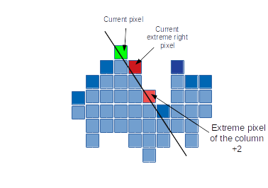
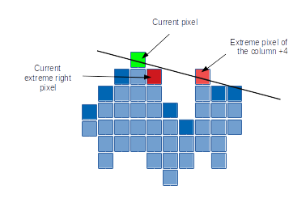
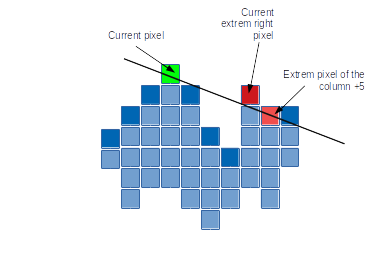
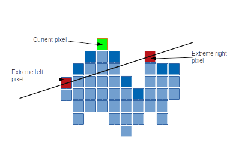
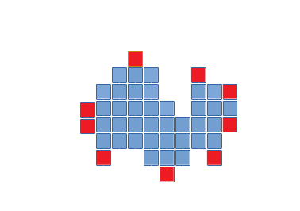

# Analysis Particles: Convex Hull

Jean Mainguy

## Introduction

The software ImageJ[^1] developed at the National Institutes of Health (NIH), USA, is a Java-based image processing and analysis program. It is available for free, open source, multithreaded and platform independent, with possibilities of developing plugins to suit specific requirements. One of the most prominent feature of the software is the analysis of particles.

Particle analysis consists of measuring different parameters over objects in the image. It is used in many fields for instance to count and measure cells in biology in an automatic and reliable way. Valuable quantitative information may be collected such as number of cells, shape or fluorescence of the cells.  This approach allows to simply compare different population of cells[^3].

For a binary or thresholded image it is possible to detect automatically the particles of the image and then count and measure them in an automatic procedure. Particle detection identifies each particle in the image. It is specific to binary images. In order to detect each particle independently, they should be distinct. For gray-levels images the process is more difficult to automate, but it opens access to new methods.

To analyze particles, it is necessary to perform first an analysis of connected components, where each of the pixels constituting the objects will be allocated a label. The labeling algorithm transforms a binary image into a symbolic image in order that each connected component is assigned a unique label. This point is related to the connectivity of the connected components. Various algorithms have been proposed as well[^VariousAlgo]. Once the binary image is labeled, each particle can goes under a variety of measures depending the kind of information required.

One of the possible measures, is the computation of convexhull. The convex hull of a particle is defined in image processing as the smallest convex shape enclosing the particle. The computation of convex hulls is a very famous and classic problem in geometrical computation and a large number of different algorithm exists to solve it such as the incremental Algorithm, the Gift Wrapping Algorithm or the Kirkpatrick-Seidel Algorithm, the Quick Hull Algorithm [^master].

The use of convex hull is crucial in many image processing tasks. For instance convex hull is used in image registration, image classification, shape extraction, content based image retrieval, feature selection, and space partitioning [^review].

Recently the usage of GPUs (Graphics processing unit) has increased in various fields of
informatics. Created at first for the sole purpose of rendering images to a display device from a
frame buffer, they prove themselves useful in other applications, such as Deep Learning or protein
docking [^hex] for instance. GPUs, contrary to CPUs (Central processing unit), are designed
to run multiple computations at the same time, and the paradigm change from one to another can
be tough to handle [^GPUimage].

In this paper we focus our attention on a GPU implementation of an algorithm finding the convex hull of a labeled image. Time comparison have been performed between this algorithm and the "gift wrap" algorithm performed by an ImageJ script.  

## Material and Methods

The algorithm implemented process a 8-bit labeled image where a specific pixel value has been given to each particle. This algorithm point out the pixels that are a vertex of the convex hull. The main challenge of this implementation is to process independently each pixel.

The algorithm presented in this paper is freely inspired of the incremental algorithm which is a variant of Graham’s algorithm[^Graham], modified by Andrew[^incremental]. This algorithm divides the problem by computing the top  and  bottom  parts  of  the convex hull  separately. It iterates through the  points,  from  the left-most vertex,  to the  right-most vertex, adding them to the hull, and checking backwards for concavities.

### Overview of the algorithm
First of all, the algorithm only investigate the pixel from the up and down border.
It starts by getting the extreme pixel on the right and the extreme pixel on the left. An extreme pixel is the most distant pixel which is visible from the current pixel meaning that is possible to draw a line between it and the current pixel without crossing another pixel of the particle.
Then depending of the convexity or concavity of the angle of the current pixel with the two extreme ones, the current pixel is a vertex of the convex hull or not.

### Description of the algorithm:

The algorithm process pixels that are part of the top or bottom border. The algorithm looks for the most extreme pixels on the right and on the left that is visible from the current pixel. Finally it checks the concavity of the angle between the current pixel and the two extreme pixels to determine if the current pixel is a vertex of the convex hull.

#### Retrieving extreme pixels

First let considered the retrieval of the extreme right pixel. To do so the right side of the current pixel is scans. First the highest particle's pixel of the adjacent column is picked and is considered as the current extreme pixel.  Then the highest pixel of the next column is picked and is confronted with the current extreme pixel. To know if the highest pixel of the second column is visible from the current pixel, the algorithm checks the position of the current extreme pixel regarding the line between the current pixel and the new extreme pixel (Fig \ref{extrem1}, \ref{extrem2} & \ref{extrem3}).

* The current extreme pixel is below or is part of the line: the new extreme pixel is visible and is then set as the current extreme pixel (Fig \ref{extrem2}).

* The current pixel is on top of the line: the current extreme pixel is unchanged (Fig  \ref{extrem1} & \ref{extrem3}).

> The current extreme right pixel is above the line joining the current pixel and the new extreme pixel. Consequently the current extreme pixel remain unchanged and the algorithm checks the next column. 

> The current extreme right pixel is below the line joining the current pixel and the new extreme pixel. consequently the extreme pixel of the column +4 become the current pixel. Then the algorithm checks the next column.

> The current extreme right pixel is above the line joining the current pixel and the new extreme pixel of column +5, consequently the current extreme pixel does not change. Then the algorithm checks the last column.

The next columns is checked, a new extreme pixel is found and it visibility is checked. This process is repeated for each columns until there is no pixel of the particle found in the columns. This process is performed on the right and on the left of the current pixel in order to have an extreme pixel from the left part and an extreme pixel from the right part.

#### Is the current pixel a vertex of the convex hull?

The position of the current pixel regarding the line between the left and right extreme pixel is calculated in order to know if the current pixel is a vertex of the convex hull:

* The current pixel is below the line: this pixel is not a vertex of the convex hull

* The current pixel is part of the line: this pixel is part of the convex hull but it is not a vertex so it is not take into account here.

* The current pixel is above the line: the pixel is a convex hull's vertex and is colored (Fig \ref{currentIsVertex}).

  
> The current pixel in green is above the line joining the right and left extrem pixel. The angle between the current pixel and the two extrem ones is then convex, and consequently the current pixel is a vertex of the hull. 

In the case where the current pixel has no neighbor pixel on one side, the pixel is immediately considered as a vertex.

Pixel from the bottom border are also checked but the positional checking is inversed: the extreme visible pixel has to be below the line and similarly the current pixel has to be below the line to be considered as a convex hull's vertex.

At the end, the algorithm has checked every pixel from the top and the bottom border and all the vertex have been found (Fig \ref{allvertex}).

  
> Result image of the algorithm, all the vertex of the convex hull have been found and displayed in a specific color

### Benchmark

Benchmark has been process in order to compare the GPU algorithm with a CPU algorithm known as the Gift Wrapping Algorithm [^Gift], implemented as an ImageJ macro [^macro].
The Gift Wrapping Algorithm  finds first the left-most vertex. Then wrap the object by choosing the next point such no points is located on the left of the line created by the current point and the next point.
Our benchmark approach was to compare the execution time of the algorithms, by increasing
regularly the size of the image. Originally, it is an 8-bit image of 200x100 pixels with 9 particles. A warm-up of 100 iterations was run first, then the time in milliseconds was measured for 100 times and the median of the set of measures was kept. The image size was doubled each time until ImageJ or the browser could not handle the memory usage. The image used is the one shown in Fig [^bench], and the benchmark test were run on a computer under linux
Ubuntu operating system with a Intel® Core™ i5-7200U CPU, frequency of the cpu of 2.50GHz, with a GPU Intel® HD Graphics 620 (Kaby Lake GT2) and  with 8 Go
of Ram, using Firefox browser for the GPU benchmark.

## Results

The results for the ImageJ algorithm are shown below in Fig. \ref{imagejB}. For GPU algorithm, the size limit was 1600x3200 pixels, while ImageJ could handle much bigger sizes, with a limit at 3200x6400 pixels.

The execution times increase proportionally to the size of the image while with the GPU algorithm remain stable around 130 ms.  

> Result of the benchmark test for ImageJ (blue) and GPU (red) algorithms. The image size doubles at every iteration.

<!--  -->

<!--  -->

## Discussion

The ImageJ implementation show clearly that the execution time increases when the image increase, larger the image is, longer it will take to process. This observation makes sens as the algorithm needs to process each particle of the image one after the other. On the contrary execution time from the GPU algorithm remain stable which suggest that the implementation is efficient and uses perfectly the capacity of parallelization of the GPU.

ImageJ seems to process the first image of 200x100   much faster than the GPU implementation, which suggest that the CPU algorithm is more efficient with small images that the GPU implementation. However it is delicate to really compare the time for a given image as the algorithm are not running though the same software. To solve this issue it would have been interesting to run a CPU algorithm though a JavaScript implementation. It would be also interesting to make a benchmark by increasing at each iteration the size of a particle and not anymore the number of particles to see how the two algorithm respond.  

Often in geometrical computation the problem of the convex hull is applied to a set of points that can be distant and not only to a particle made of touching pixels. Our implementation of the GPU algorithm could be easily extended to a set of points. To do so the search of the most extreme pixel on both side should not end when there is no pixel in the column but until it reach the border of the image.

## Conclusion

GPU usage to analyze images is still relatively new but the gain in speed is always a considerable asset. In this paper, the
proposed GPU algorithm shows very clear and interesting result and seems to be very competitive in term of speed to regular CPU algorithm while processing large image.

[^1]:
Schneider CA, Rasband WS, Eliceiri KW. NIH Image to ImageJ: 25 years of image analysis. Nat Methods. 2012 Jul;9(7):671-5

[^2]:
Ferreira T, Rasband W, (2010-2012). ImageJ User Guide. https://imagej.nih.gov/ij/docs/guide/146.html

[^3]:
Jensen EC1,Quantitative analysis of histological staining and fluorescence using ImageJ,Anat Rec (Hoboken). 2013 Mar;296(3):378-81.

[^4]:
Lehmann G and Legland D. "Efficient N-Dimensional surface estimation using Crofton formula and run-length encoding". Insight Journal. 2012; 1-11

[^MorphoPlugin]:
Arganda-Carreras I, Legland D, Mikushin D, et al. (2017, September 9). ijpb/MorphoLibJ: Release v1.3.3. Zenodo. http://doi.org/10.5281/zenodo.888094

[^Book]:
Russ JC. The Image Processing Handbook. 4th ed.  London: CRC Press; 2002

[^Zhang]:
Zhang G, Jayas DS, White NDG. Separation of Touching Grain Kernels in an Image by Ellipse Fitting Algorithm. Biosystems Engineering. 2005; 92(2):135-142

[^Feret]:
Feret LR. “La Grosseur des Grains”. Assoc. Intern. Essais Math. 2D, Zurich. 1931

[^Feret2]:
Briguet A, Courdier-Fruh I, Foster M, et al. Histological parameters for the quantitative assessment of muscular dystrophy in the mdx-mouse. Neuromuscular Disorders. 2004; 14(10):675-682

[^Perimeter]:
Freeman H. On the Encoding of Arbitrary Geometric Configurations. IRE Transactions on Electronic Computers. 1961 Jun; EC-10(2)

[^EllipseFitter]:
https://imagej.nih.gov/ij/developer/source/ (EllipseFitter)

[^ShapeDescriptor]:
Zdilla MJ, Hatfield SA, McLean KA, Cyrus LM, Laslo JM, Lambert HW. Circularity, solidity, axes of a best fit ellipse, aspect ratio, and roundness of the foramen ovale: a morphometric analysis with neurosurgical considerations. The Journal of craniofacial surgery. 2016;27(1):222-228.

[^Convex]:
Cris luengo. ( page consultée le 20/09/2017). Computing Feret diameters from the convex hull.http://www.crisluengo.net/index.php/archives/408

[^VariousAlgo]:
Suzuki KE,Horiba IS,SugieNO, Linear-time connected-component labeling based on sequential local operations,Computer Vision and Image Understanding 89 (2003) 1–23

[^Chang]:
Chang, F. et al. A linear-time component-labeling algorithm using contour tracing technique. Computer Vision and Image Understanding; 2003 Oct

[^OptimalValues]:
D.Proffit,D.Rosen,Computer Graphics and Image Processing 10(4):318-332, 1979

[^ImageJ]:
IJ Blob ( page consultée le 20/12/2017). https://imagej.net/IJ_Blob

[^twopass_blog]:
Connected-component-labelling (page consultée le 20/12/2017). http://aishack.in/tutorials/connected-component-labelling

[^hex]:
Macindoe, G., Mavridis, L., Venkatraman, V., Devignes, M. D., & Ritchie, D. W. (2010). HexServer: an FFT-based protein docking server powered by graphics processors. Nucleic acids research, 38(suppl_2), W445-W449.

[^incremental]:
Andrew, A. M. (1979). Another efficient algorithm for convex hulls in two dimensions. Information Processing Letters, 9(5), 216-219.

[^Graham]:
Graham, R. L. (1972). An efficient algorith for determining the convex hull of a finite planar set. Information processing letters, 1(4), 132-133.

[^Gift]:
Jarvis, R. A. (1973). On the identification of the convex hull of a finite set of points in the plane. Information processing letters, 2(1), 18-21.

[^macro]:
https://imagej.nih.gov/ij/macros/ConvexHull.txt

[^review]:
Jayaram, M. A., & Fleyeh, H. (2016). Convex hulls in image processing: A scoping review. American Journal of Intelligent Systems, 6(2), 48-58.

[^GPUimage]:
Asano, S., Maruyama, T., & Yamaguchi, Y. (2009, August). Performance comparison of FPGA, GPU and CPU in image processing. In Field programmable logic and applications, 2009. fpl 2009. international conference on (pp. 126-131). IEEE.

[^master]
Mortensen, B. (2015). Algorithms for Computing Convex Hulls Using Linear Programming (Doctoral dissertation, Aarhus Universitet, Datalogisk Institut).
